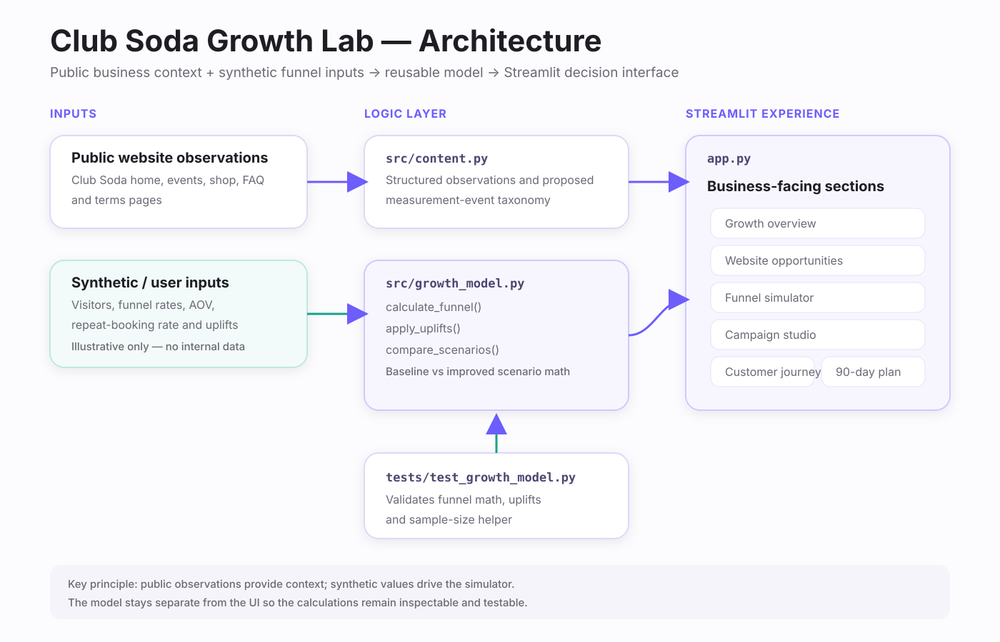

# Club Soda Growth Lab

**Digital sales, customer journey and conversion optimisation prototype for Club Soda**

[Live Demo](https://club-soda-growth-lab.streamlit.app/)

Club Soda Growth Lab is an independent Streamlit case study that models how acquisition, event discovery, booking, post-event follow-up and the upcoming shop can be treated as one measurable growth journey.

> **Data disclaimer**
>
> This repository does **not** use Club Soda internal analytics, CRM data, ad-account data, customer records or sales results. Public Club Soda website information is used only for business context. All numerical performance inputs and outputs in the simulator are **synthetic / illustrative** and must not be interpreted as actual Club Soda performance or forecasts.

## Product goal

The prototype is built around one simple question:

**How can more existing interest be converted into bookings, future shop sales and repeat customers?**

The app keeps the commercial journey visible from end to end:

```text
Discover → Explore → Booking intent → Purchase → Follow-up → Repeat
```

Rather than optimising isolated vanity metrics, each section connects an action to a measurable customer behaviour.

## App sections

| Section | Purpose |
| --- | --- |
| **Growth overview** | Highlights event conversion, shop-launch demand and retention as the three main growth priorities. |
| **Website opportunities** | Maps visible journey opportunities to one practical action and one primary measure. |
| **Funnel simulator** | Compares a synthetic baseline with an improved scenario to show how changes at funnel stages can affect bookings and revenue. |
| **Campaign studio** | Connects campaign objective, message, creative direction, landing experience, follow-up and business measure. |
| **Customer journey** | Uses simple behaviour-based customer states to define the next useful action. |
| **90-day action plan** | Organises implementation into **Measure → Test → Scale**. |

## Architecture



### Code responsibilities

- **`app.py`** — Streamlit interface, page navigation, visualisations, scenario controls and business-facing content.
- **`src/growth_model.py`** — reusable funnel calculations, uplift application, baseline/improved comparison and an approximate two-proportion sample-size utility.
- **`src/content.py`** — structured public observations, proposed measurement events, segments, experiments and roadmap content. The current UI directly imports the proposed `MEASUREMENT_EVENTS` taxonomy; the remaining structures are retained as reusable strategy definitions.
- **`tests/test_growth_model.py`** — validates core funnel arithmetic, non-decreasing positive-uplift scenarios and sample-size output.
- **`.streamlit/config.toml`** — Streamlit theme and server configuration.

## Funnel model

The core simulator is intentionally simple and transparent.

For a baseline scenario:

```text
Event / product views = Visitors × Event-view rate

Checkout starts = Event / product views × Checkout-start rate

Purchases = Checkout starts × Purchase-completion rate

Revenue = Purchases × Average order value

Repeat bookings = Purchases × Repeat-booking rate
```

The app then creates an improved scenario by applying relative uplifts to selected rates and compares the result with the baseline.

### Relative uplift is not percentage-point uplift

Simulator improvement controls apply **relative changes**.

For example:

```text
16% checkout-start rate
+ 10% relative uplift
= 17.6%
```

It does **not** mean 16% becomes 26%.

When the same relative uplift is applied to more than one funnel stage, the effects compound through the funnel.

## Synthetic demonstration inputs

The application contains default values so the simulator works without any private company data.

Examples used in the code include:

| Input | Illustrative default |
| --- | ---: |
| Monthly visitors | 8,000 |
| Event / product-page reach | 42% |
| Checkout-start rate | 16% |
| Purchase-completion rate | 62% |
| Average order value | €32 |
| 30-day repeat-booking rate | 18% |

The Growth Overview uses a separate simplified **1,000-visitor** scenario for quick visual explanation.

These values are **demonstration assumptions only**. They are not estimates of Club Soda's real traffic, conversion rate, order value, repeat rate or revenue.

### What the revenue output means

The headline revenue calculation is:

```text
Purchases × Average order value
```

Repeat bookings and repeat revenue are calculated separately in the model. The app does not present the simulator as a customer-lifetime-value model.

## Measurement design

The prototype includes a proposed event taxonomy for implementation:

```text
view_home
view_event
select_event
begin_checkout
purchase
newsletter_signup
shop_waitlist_signup
post_event_engagement
repeat_booking
```

This is a **proposed measurement structure**, not a claim about Club Soda's current analytics implementation.

## Public website context

The case study was informed by publicly accessible Club Soda pages:

- https://www.clubsoda.ie/
- https://www.clubsoda.ie/events/
- https://www.clubsoda.ie/shop/
- https://www.clubsoda.ie/events/faq-s/
- https://www.clubsoda.ie/terms-of-service/

The code separates public observations from proposed strategy and synthetic numerical scenarios.

## Technology

- Python
- Streamlit
- Pandas
- Plotly
- Python dataclasses
- Pytest-compatible unit tests

Runtime dependencies are pinned by range in `requirements.txt`:

```text
streamlit>=1.40,<2
pandas>=2.2,<3
plotly>=5.24,<7
```

## Repository structure

```text
club-soda-growth-lab/
├── app.py
├── src/
│   ├── __init__.py
│   ├── content.py
│   └── growth_model.py
├── tests/
│   └── test_growth_model.py
├── .streamlit/
│   └── config.toml
├── requirements.txt
├── LICENSE
└── README.md
```

## Run locally

```bash
git clone https://github.com/iamabhishek841/club-soda-growth-lab.git
cd club-soda-growth-lab

python -m venv .venv
source .venv/bin/activate
# Windows: .venv\Scripts\activate

pip install -r requirements.txt
streamlit run app.py
```

## Run the tests

Pytest is only required for development/testing and is not part of the Streamlit runtime requirements.

```bash
pip install pytest
pytest -q
```

Current tests cover:

1. Core funnel arithmetic.
2. Positive uplift scenarios do not reduce bookings or revenue.
3. The two-proportion sample-size helper returns a positive planning value for a valid case.

## Deployment

The app is designed for Streamlit Community Cloud:

1. Select this GitHub repository.
2. Use the `main` branch.
3. Set the main file path to `app.py`.
4. Deploy.

No application secrets are required by the current code.

## Design principles

1. **No invented company results** — simulator values are explicitly synthetic.
2. **Transparent calculations** — the funnel math is small, inspectable and reusable.
3. **Behaviour before vanity metrics** — focus on booking intent, purchases and repeat behaviour.
4. **Practical segmentation** — customer states are based on observable behaviour rather than unnecessary personal inference.
5. **Measure before scaling** — proposed actions are tied to a measurable outcome.
6. **Relative uplifts are explicit** — improvement controls modify rates relatively, not by percentage points.
7. **Business-facing first** — technical detail supports the decision rather than dominating the interface.

## Scope and limitations

This is a portfolio prototype, not a production marketing platform.

It does not currently connect to:

- live Club Soda analytics
- advertising platforms
- CRM or email systems
- payment or booking APIs
- customer databases
- real-time campaign or revenue data

A production implementation would replace synthetic assumptions with validated first-party data and connect measurement to the actual marketing, booking and lifecycle systems in use.

---

Club Soda is a third-party business and is not affiliated with this repository. Brand names are referenced only to explain the independent portfolio case study.
